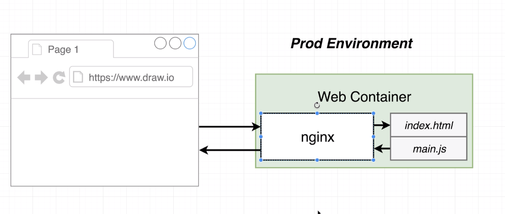
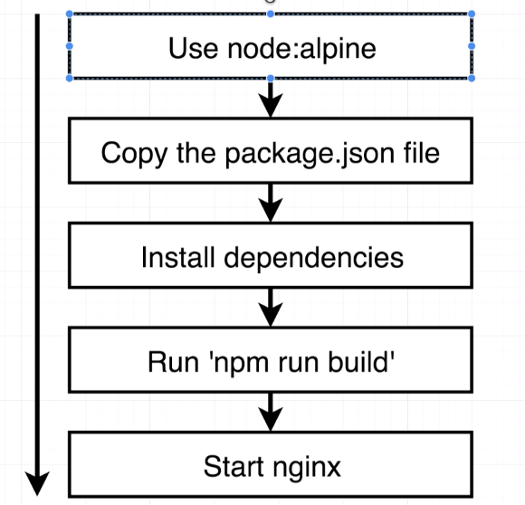
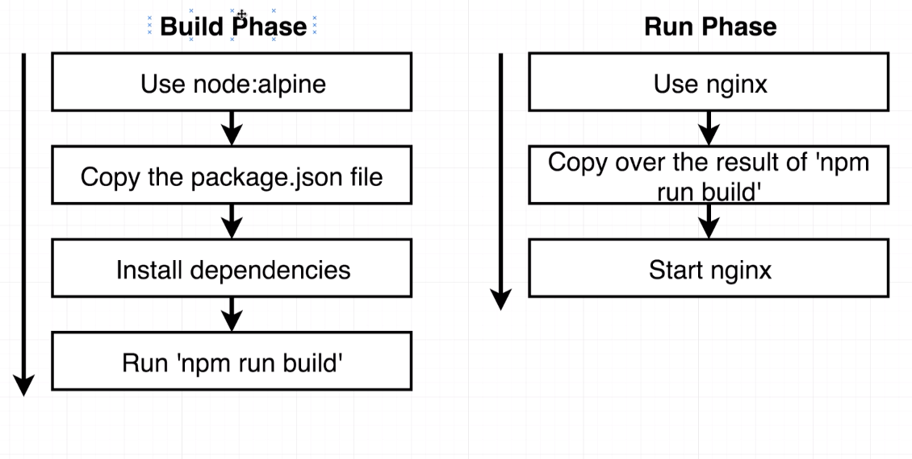

# Demo for CICD using Travis CI

## Instructions
• Using `Dockerfile.dev` for development startup    
• Run `docker build -f Dockerfile.dev .` in the directory to build the image    
• Run `docker run -it -p 3000:3000 CONTAINER_ID`    

This runs into an issue where updated code won't be reflected in the running container since the docker build takes a snapshot of the source code.
In order to have a straight copy, we need a different flow using `Docker volume`

### Docker Volumes

Instead of this:
```
Local Folder
  - frontend
  - /src
  - /public
```

Being copied over as 

```
Docker Container
  - /app
    - /src
    - /public
```

We will use it as:
```
Docker Container
  - /app
    - /src (references /src in local folder)
    - /public (references /public in local folder)
```

So we are essentially mapping references to the files. Sometimes the docker volumes are harder to setup, so we don't do this with simpler projects.

The essential "formula" for the docker volume command is:
`docker run -it -p 3000:3000 -v /app/node_modules -v $(pwd):/app <image_id>`    
• `-v /app/node_modules`: put a bookmark on the `node_modules` folder      
• `-v $(pwd):/app`: map the `pwd` into the `/app` folder      

If you try to run `docker run -it -p 3000:3000 -v $(pwd):/app <image_id>`, it will not work if you do not have `node_modules` directory locally. This is because `$(pwd)` is the current local working directory is the being referenced by what's on the right-hand side of `:`, which is `/app`: 

```
Docker Container
  - /app
    - /src (references /src in local folder)
    - /public (references /public in local folder)
    - /node_modules (references /node_modules in local folder) // THIS DOESN'T EXIST IN LOCAL FOLDER, SO HAS A NULL REFERENCE
```
So if you don't have `node_modules` locally, then you must add `-v /app/node_modules` as part of the command. This is saying that specific directory structure in the container should not be referencing anything in the local directory.

### Using docker-compose file for docker volumes
See `/docker-compose.yml` file for example.    
An update to `cra` leads to application exiting with code 0. Add stdin_open property to your docker-compose.yml file:
```
  web:
    stdin_open: true
```
Make sure you rebuild your containers after making this change with  docker-compose down && docker-compose up --build

https://github.com/facebook/create-react-app/issues/8688    
https://stackoverflow.com/questions/60790696/react-scripts-start-exiting-in-docker-foreground-cmd    

### Using dockerfile in docker-compose.yml
In our `Dockerfile.dev`, we have a command to copy everything in the pwd over to the docker image instance. But since we are using docker volumes and referencing directories from the container to the local folder (except `node_modules`), we don't need the copy command in the `Dockerfile.dev` file.

But, it's still worth having it because:
1. It reminds the devops to copy over the folders if `docker-compose.yml` is no longer being used
2. No more changes are needed in the pwd, especially if it's on production

## Running tests
We have an script command `test` that will execute tests. To do this manually, we can do the following:
1. Build container - `docker build -f Dockerfile.dev .`
2. Run container - `docker run -it containerId npm run test`

By doing so, we can see the tests running. But we can't update tests and expect the container to know about these changes since it's a snapshot of the code when we built it.

So, we need to run the following:
1. Build, create, and start and attach container to service - `docker-compose up`
2. Enter the running container and execute test command = `docker exec -it containerId npm run test`

At this point, any changes to tests will automatically update. But there is a better way to do this using the `docker-compose.yml` file

We updated the `docker-compose.yml` file to include a new service:
```
 tests:
    build:
      context: .
      dockerfile: Dockerfile.dev
    volumes:
      - /app/node_modules
      - .:/app
    command: ["npm", "run", "test"]
```

We are using the same dockerfile and same volumes, except the command is different. Now we can run `docker-compose up --build` (`--build` just to ensure everything is built properly, a good thing to do when defining a new service to the yml file). At this point, we should have the app service running and accessible, as well as the test. And the tests can be live updated as well.

The fallback behind using docker-compose is that while we can have updated tests, we can't enter in shell commands for the test prompts (like watch, run failed tests only, etc). This is because:

1. `npm` is the first process running in the container. This has file handles such as `stdin`, `stout`, and `sterr`. When we use docker-compose to build and start the containers, the first process is the `npm`. Then the `npm` looks at the command prompt, and it runs `test`, which is a second, completely new process that runs in the container.
2. Unfortunately, docker only maps the shell commands that we enter into the terminal to the file handles of the first process, which is `npm`. It cannot map to the second process, `test`, which has its own file handles, but it has no way of listening to what we actually enter into the terminal. We can test this by running `docker attach containerId` and trying to execute commands. See this image: 

## Production Environment
We need a different `Dockerfile` for production environment. We don't want to run a dev server in production because the server takes a lot of processing power to reflect updates to code. There are no updates on prod, so we need to use a web server that handles incoming traffic and responds with appropriate static files. We can use nginx for this web server.

1. Dev environment: 
2. Prod environment: 

Production process: 

But there is a problem with this process... 

Once deps are built, we don't need to install these deps. Also, we need to configure nginx so it has that web server in the container. 

But, we need to install the nginx base image - yet we are already using `node:alpine` image. So we need to figure out a way to do install 2 base images: 


### Multi-step build process
See `Dockerfile` for example. The differences from `Dockerfile.dev`:

1. The first base image `FROM node:alpine` now has a tag: `as builder`
2. We are copying over everything that was built from the first phase on to the 2nd base image. The `--from=` indicates we want to copy over something from a different docker phase: `COPY --from=builder /app/build /usr/share/nginx/html`
3. The `/usr/share/nginx/html` is just the directory location that nginx has configured to place static files in.
4. The `Start nginx` step is not required in the `Dockerfile` because the docker nginx container by default will start up nginx.

Now that we defined our `Dockerfile`, we can test the prod process:
1. Build container: `docker build .` (no `-f` needed to specify file since we're using default `Dockerfile` file)
2. Once built, run the container: `docker run -it -p 8080:80 containerId`
• Port 80 is the default port for nginx, so that's what we map it to


# Continuous Integration and Deployment using Travis CI
TravisCI was setup by integrating with GitHub. We now need a yml file for Travis CI. We need to tell Travis CI how to start docker, run test suites, and interpret results.

See `.travis.yml` for details.

#### NOTE: Due to a change in how the Jest library works with Create React App, we need to make a small modification:

```
script:
  - docker run USERNAME/docker-react npm run test -- --coverage
 ```

instead should be:

```
script:
  - docker run -e CI=true USERNAME/docker-react npm run test
```

Additionally, you may want to set the following property to the top of your .travis.yml file:

`language: generic `
You can read up on the CI=true variable here:
https://facebook.github.io/create-react-app/docs/running-tests#linux-macos-bash

and enviornment variables in Docker here:
https://docs.docker.com/engine/reference/run/#env-environment-variables

#### Good to know
On our local machine, running `docker run containerId npm run test` executes the test, but the result of that is just the test suite waiting for an input and hangs. It will timeout and exit eventually, and TravisCI will interpret any result that's not exit code 0 to be a failure. So to run our test, we need to modify this command. See image below for pipeline steps:


So running `docker run -e CI=true simmonson/docker-cicd-aws npm run test` will run the test, and return a status code upon completion of its test suites. TravisCI only cares about the output result of this status code, so if all tests pass, it will return a successful 0 exit code.

After defining the yml file, we can push the changes to the github branch, and TravisCI should take over from here. You can look at your repository on TravisCI dashboard and see the build and test run process:


# Using AWS Elastic Beanstalk
We are using this as our deployment platform. In order to do something after Travis CI pipeline is successful, we need to setup the AWS account, as well as make additional `deploy` configurations to `.travis.yml` file.
```
provider: elasticbeanstalk // deployment provider
  region: "us-west-2" // region as specified
  app: "docker-cicd-aws" // app name created in beanstalk
  env: "DockerCicdAws-env" // env automatically generated when creating app in beanstalk
  bucket_name: "elasticbeanstalk-us-west-2-720252850272" // bucket name is found by searching the S3 bucket automatically generated 
  bucket_path: "docker-cicd-aws" // the s3 bucket specified has multiple paths. define one here using the same name as app
  on:
    branch: master // deploy to aws beanstalk when master branch on github is updated
```

#### Good to know
Need configs set up like below for `.travis.yml` file:
```
access_key_id: $AWS_ACCESS_KEY
secret_access_key: $AWS_SECRET_KEY
```


# AWS Configuration Cheat Sheet as of June, 2020

Tested with the new Platform without issue: Docker running on 64bit Amazon Linux 2/3.0.3

Initial Setup

1. Go to AWS Management Console

2. Search for Elastic Beanstalk in "Find Services"

3. Click the "Create Application" button

4. Enter "docker" for the Application Name

5. Scroll down to "Platform" and select "Docker" from the dropdown list. Leave the rest as defaults.

6. Click "Create Application"

7. You should see a green checkmark after some time.

8. Click the link above the checkmark for your application. This should open the application in your browser and display a Congratulations message.

Change from Micro to Small instance type:

Note that a t2.small is outside of the free tier. t2 micro has been known to timeout and fail during the build process.

1. In the left sidebar under Docker-env click "Configuration"

2. Find "Capacity" and click "Edit"

3. Scroll down to find the "Instance Type" and change from t2.micro to t2.small

4. Click "Apply"

5. The message might say "No Data" or "Severe" in Health Overview before changing to "Ok"

Add AWS configuration details to .travis.yml file's deploy script

1. Set the region. The region code can be found by clicking the region in the toolbar next to your username.

eg: 'us-east-1'

2. app should be set to the Application Name (Step #4 in the Initial Setup above)

eg: 'docker'

3. env should be set to the lower case of your Beanstalk Environment name.

eg: 'docker-env'

4. Set the bucket_name. This can be found by searching for the S3 Storage service. Click the link for the elasticbeanstalk bucket that matches your region code and copy the name.

eg: 'elasticbeanstalk-us-east-1-923445599289'

5. Set the bucket_path to 'docker'

6. Set access_key_id to $AWS_ACCESS_KEY

7. Set secret_access_key to $AWS_SECRET_KEY

Create an IAM User

1. Search for the "IAM Security, Identity & Compliance Service"

2. Click "Create Individual IAM Users" and click "Manage Users"

3. Click "Add User"

4. Enter any name you’d like in the "User Name" field.

eg: docker-react-travis-ci

5. Tick the "Programmatic Access" checkbox

6. Click "Next:Permissions"

7. Click "Attach Existing Policies Directly"

8. Search for "beanstalk"

9. Tick the box next to "AWSElasticBeanstalkFullAccess"

10. Click "Next:Tags"

11. Click "Next:Review"

12. Click "Create user"

13. Copy and / or download the Access Key ID and Secret Access Key to use in the Travis Variable Setup.

Travis Variable Setup

1. Go to your Travis Dashboard and find the project repository for the application we are working on.

2. On the repository page, click "More Options" and then "Settings"

3. Create an AWS_ACCESS_KEY variable and paste your IAM access key from step #13 above.

4. Create an AWS_SECRET_KEY variable and paste your IAM secret key from step #13 above.

Deploying App

1. Make a small change to your src/App.js file in the greeting text.

2. In the project root, in your terminal run:

git add.
git commit -m “testing deployment"
git push origin master
3. Go to your Travis Dashboard and check the status of your build.

4. The status should eventually return with a green checkmark and show "build passing"

5. Go to your AWS Elasticbeanstalk application

6. It should say "Elastic Beanstalk is updating your environment"

7. It should eventually show a green checkmark under "Health". You will now be able to access your application at the external URL provided under the environment name.